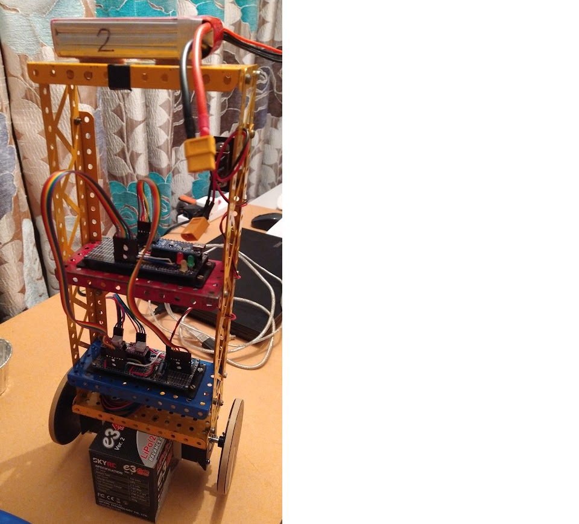

# BalancingRobot
This my balancing robot code.
I built a balancing robot. This consisted of an Arduino, an MPU6050 inertial measurement unit (IMU), stepper-motors, motor drivers and lots of patience to build.
The robot uses an Arduino Nano microcontroller as the ‘brain’ and an IMU for sensing the angle. The stepper-motors would move to catch the robot before it would enter a fall. This took a lot of fi ne-tuning so that the motors didn’t over-correct and send the robot falling in the opposite direction!

